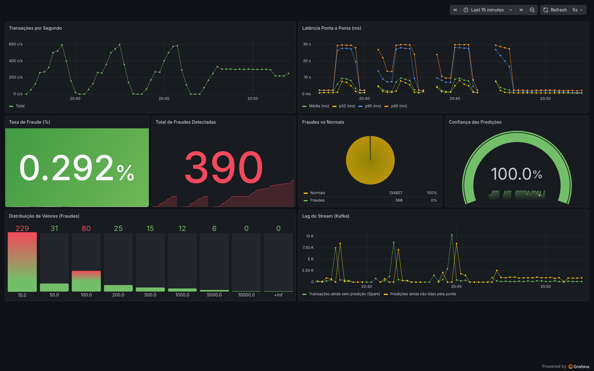
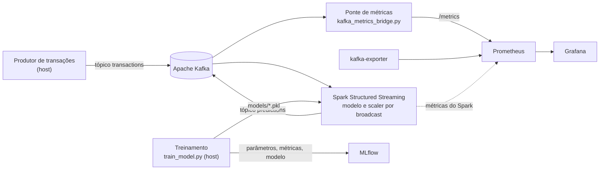

# Arquitetura de Big Data e MLOps para detecção de fraudes em tempo real

Pilha completa, em contêineres, que recebe transações de cartão de crédito por um tópico do Apache Kafka, classifica cada uma com um modelo de Machine Learning dentro do Apache Spark Structured Streaming e mostra o resultado em um painel do Grafana. O treinamento é registrado no MLflow.

O objetivo do trabalho é que a arquitetura seja **replicável**: todos os serviços sobem com um único `docker compose up`, com versões fixadas, e este documento descreve cada passo necessário para chegar do repositório recém-clonado ao painel funcionando.



## Sumário

- [Como funciona](#como-funciona)
- [Requisitos](#requisitos)
- [Passo a passo](#passo-a-passo)
- [Endereços dos serviços](#endereços-dos-serviços)
- [Escalar o processamento](#escalar-o-processamento)
- [Reproduzir as medições](#reproduzir-as-medições)
- [Parar e limpar](#parar-e-limpar)
- [Problemas comuns](#problemas-comuns)
- [Estrutura do repositório](#estrutura-do-repositório)
- [Limitações](#limitações)
- [Base de dados](#base-de-dados)

## Como funciona



1. **Treinamento** (`src/train_model.py`, no host): compara Regressão Logística, Árvore de Decisão e Random Forest com `GridSearchCV` e SMOTE, registra tudo no MLflow e grava o melhor modelo em `models/best_model.pkl`, com o `StandardScaler` em `models/scaler.pkl`.
2. **Ingestão**: um produtor publica cada transação como JSON no tópico `transactions`.
3. **Inferência** (`src/spark_streaming.py`, no contêiner `spark-streaming`): o Spark lê o tópico em micro-lotes, aplica o scaler e o modelo (distribuídos por *broadcast*) com `mapInPandas` e publica as predições no tópico `predictions`.
4. **Observabilidade** (`src/kafka_metrics_bridge.py`, no contêiner `metrics-bridge`): consome `predictions`, calcula a latência ponta a ponta e expõe as métricas para o Prometheus. O Grafana já sobe com a fonte de dados e o painel provisionados.

Serviços do `docker-compose.yml`:

| Serviço | Imagem | Função |
|---|---|---|
| `kafka` | `confluentinc/cp-kafka:8.2.1` | Broker em modo KRaft (sem ZooKeeper) |
| `kafka-init` | `confluentinc/cp-kafka:8.2.1` | Cria os tópicos `transactions` e `predictions` e encerra |
| `kafka-exporter` | `danielqsj/kafka-exporter:latest` | Métricas do Kafka para o Prometheus |
| `spark-master`, `spark-worker` | `tcc-spark:4.1.2` (construída localmente) | Cluster Spark autônomo; cada worker oferece 2 núcleos |
| `spark-streaming` | `tcc-spark:4.1.2` | Driver do fluxo de inferência |
| `metrics-bridge` | `tcc-spark:4.1.2` | Ponte de métricas |
| `prometheus` | `prom/prometheus:latest` | Coleta das séries temporais |
| `grafana` | `grafana/grafana:latest` | Painel de operação |
| `mlflow` | `ghcr.io/mlflow/mlflow:v3.13.0` | Rastreio de experimentos |

## Requisitos

| Item | Versão usada no trabalho | Observação |
|---|---|---|
| Sistema | Linux x86_64 | Único sistema testado |
| Docker Engine | 29.7.2 | |
| Docker Compose | 5.5.0 (plugin `docker compose`) | O arquivo usa `start_interval` nos healthchecks, que exige Compose 2.20.2 ou mais novo |
| Python (host) | 3.14 | Usado só para treinar o modelo e enviar transações |
| Git | qualquer | |

Recursos da máquina em que tudo foi executado e medido: 8 CPUs lógicas (AMD Ryzen 3 5300U) e 7,1 GiB de memória. As imagens ocupam cerca de 6,5 GB de disco; a base de dados, 144 MB.

Portas que precisam estar livres no host: `3000`, `4040`, `5000`, `7077`, `8000`, `8080`, `9090`, `9092` e `9308`.

## Passo a passo

Todos os comandos são executados a partir da raiz do repositório.

### 1. Clonar o repositório

```bash
git clone <URL-do-repositório> tcc
cd tcc
```

### 2. Baixar a base de dados

A base não está no repositório (150 MB, acima do limite de arquivo do GitHub). Baixe **Credit Card Fraud Detection** em <https://www.kaggle.com/datasets/mlg-ulb/creditcardfraud> (é preciso ter conta no Kaggle), descompacte e coloque o arquivo em `base_fraudes/creditcard.csv`.

Com a [CLI do Kaggle](https://github.com/Kaggle/kaggle-api) configurada, o mesmo resultado sai com:

```bash
kaggle datasets download -d mlg-ulb/creditcardfraud -p base_fraudes --unzip
```

Confira se o arquivo é o mesmo usado no trabalho (284.807 transações, 150.828.752 bytes):

```bash
sha256sum base_fraudes/creditcard.csv
# 76274b691b16a6c49d3f159c883398e03ccd6d1ee12d9d8ee38f4b4b98551a89
```

### 3. Criar o arquivo `.env`

```bash
cp .env.example .env
id -u; id -g
```

Se os dois números impressos não forem `1000`, edite `HOST_UID` e `HOST_GID` no `.env` com os seus valores. Os contêineres gravam em `medicoes/raw/` com esse usuário; com o valor errado, o fluxo falha por falta de permissão.

### 4. Preparar o ambiente Python do host

```bash
python3.14 -m venv venv
venv/bin/pip install --upgrade pip
venv/bin/pip install -r requirements.txt
```

O nome `venv` é obrigatório: os scripts de medição chamam `venv/bin/python`. As versões do `requirements.txt` são as mesmas da imagem Spark, porque o modelo é serializado no host e carregado dentro dos contêineres.

### 5. Construir a imagem e subir o MLflow

```bash
docker compose build
docker compose up -d mlflow
```

A construção baixa o Java, o PySpark e o conector Kafka do Spark, e leva alguns minutos na primeira vez. O treinamento do próximo passo registra os experimentos no MLflow, por isso ele sobe antes dos demais serviços. Espere até `docker compose ps mlflow` mostrar `healthy`.

### 6. Treinar o modelo

```bash
venv/bin/python src/train_model.py
```

O script faz a busca de hiperparâmetros dos três modelos com validação cruzada e usa todos os núcleos da máquina; reserve vários minutos. Ao final, existem:

- `models/best_model.pkl` e `models/scaler.pkl`, usados pelo fluxo de inferência;
- `models/lr_best.pkl`, `models/dt_best.pkl` e `models/rf_best.pkl`;
- `data/model_comparison.csv`, com a comparação no conjunto de teste;
- três execuções no experimento `FraudDetectionCreditCard`, em <http://localhost:5000>.

Resultado obtido no trabalho (conjunto de teste, 20% da base, `random_state=42`):

| Modelo | ROC-AUC | Precisão média | F1 |
|---|---|---|---|
| Regressão Logística | 0,9660 | 0,7505 | 0,5133 |
| Árvore de Decisão | 0,9272 | 0,6541 | 0,6125 |
| Random Forest (escolhido) | 0,9647 | 0,8594 | 0,8000 |

### 7. Subir a pilha completa

```bash
docker compose up -d
docker compose ps
```

Em menos de um minuto, todos os serviços listados devem aparecer como `healthy`, com exceção de `kafka-exporter`, que não tem verificação de saúde. O `kafka-init` não aparece na lista: ele encerra com código 0 depois de criar os tópicos (visível com `docker compose ps -a`). No trabalho, com as imagens já construídas, a pilha levou 31,6 s ± 1,2 s para ficar saudável a partir do zero (N = 3).

Confira também os alvos do Prometheus em <http://localhost:9090/targets>: os cinco *jobs* (`fraud_detection_pipeline`, `kafka`, `spark`, `spark_driver` e `spark_worker`) devem estar `UP`.

### 8. Enviar transações

Com `spark-streaming` saudável, envie uma carga com taxa controlada:

```bash
venv/bin/python medicoes/scripts/load_producer.py --rate 200 --duration 120 --run-id demo
```

Cada mensagem é uma linha real do `creditcard.csv`, acrescida do instante de envio (`timestamp`), de um identificador sequencial (`tx_id`) e do `run_id`. Ao terminar, o script imprime um resumo em JSON com a quantidade enviada e a taxa efetiva.

O fluxo começa em `STARTING_OFFSETS=latest`: só são processadas as transações que chegam depois que o driver está ativo. Mensagens enviadas antes disso não aparecem no painel.

Há também um produtor interativo, `venv/bin/python src/kafka_producer.py`, que percorre a base inteira.

### 9. Acompanhar o resultado

Abra <http://localhost:3000>, entre com usuário `admin` e senha `admin`, e abra o painel **Fraud Detection - Monitoramento em Tempo Real**. Enquanto a carga roda, os gráficos de transações por segundo, latência ponta a ponta, total de fraudes e lag do fluxo se atualizam a cada 5 segundos.

Para ver as predições diretamente no Kafka:

```bash
docker compose exec kafka kafka-console-consumer --bootstrap-server kafka:29092 \
  --topic predictions --max-messages 5
```

## Endereços dos serviços

| Serviço | Endereço | Observação |
|---|---|---|
| Grafana | <http://localhost:3000> | `admin` / `admin` |
| Prometheus | <http://localhost:9090> | |
| MLflow | <http://localhost:5000> | |
| Spark (mestre) | <http://localhost:8080> | |
| Spark (driver do fluxo) | <http://localhost:4040> | |
| Métricas da ponte | <http://localhost:8000/metrics> | |
| Métricas do Kafka | <http://localhost:9308/metrics> | |
| Kafka | `localhost:9092` | A partir do host; entre contêineres, `kafka:29092` |

A senha `admin` do Grafana é a padrão, definida no `docker-compose.yml`, e a pilha não usa autenticação nem criptografia no Kafka. Isso serve para execução local. Antes de expor qualquer porta em rede, troque a senha e restrinja o acesso.

## Escalar o processamento

O número de workers do Spark é definido na subida, sem alterar arquivos:

```bash
SPARK_CORES_MAX=6 docker compose up -d --scale spark-worker=3
```

`SPARK_CORES_MAX` deve valer 2 × o número de workers, para que o primeiro micro-lote só seja agendado depois de todos os executores registrarem. O Prometheus descobre os novos workers sozinho.

O paralelismo do fluxo acompanha o número de partições do tópico `transactions` (3 por padrão, em `TOPIC_PARTITIONS`). Com 1 partição, acrescentar workers não aumentou a vazão nas medições. O valor de `TOPIC_PARTITIONS` só é aplicado na criação dos tópicos; para mudá-lo depois, recrie a pilha com `docker compose down -v`.

Cada worker reserva 1 GiB (`SPARK_WORKER_MEMORY`). Na máquina de 7,1 GiB usada no trabalho, 3 workers junto com o restante da pilha levaram a memória ao limite.

## Reproduzir as medições

Os scripts em `medicoes/scripts/` geraram todos os números do trabalho. Os resultados obtidos, com a descrição de cada método, estão em [`resultados_medicoes.md`](resultados_medicoes.md), e os CSVs resumidos, nas pastas `medicoes/A_ambiente` a `medicoes/I_reprodutibilidade`.

Todos rodam a partir da raiz, com a pilha no ar e o modelo treinado. Eles param, recriam e reiniciam serviços por conta própria.

| Item | Comando | O que mede |
|---|---|---|
| A | `bash medicoes/scripts/A_ambiente.sh` | Processador, memória, versões e imagens |
| B | `venv/bin/python medicoes/scripts/B_inferencia_processo_unico.py 30 0 medicoes/B_inferencia/sem_metricas.csv` | Inferência em processo único, na base completa |
| C | `venv/bin/python medicoes/scripts/C_equivalencia.py` | Se o caminho Spark devolve as mesmas predições do caminho Pandas |
| D, F | `venv/bin/python medicoes/scripts/D_ponta_a_ponta.py 100,500,1000 5 60` | Vazão, latência ponta a ponta, lag e uso de recursos por taxa |
| E | `venv/bin/python medicoes/scripts/E_escalabilidade.py` | Vazão máxima por combinação de workers e partições |
| G | `venv/bin/python medicoes/scripts/G_recuperacao.py 500` | Perdas e duplicatas após a queda do driver e de um worker |
| H | `venv/bin/python medicoes/scripts/H_capturas.py` | Capturas de tela das interfaces |
| I | `venv/bin/python medicoes/scripts/I_reprodutibilidade.py` | Tempo para subir a pilha do zero |

Observações:

- Os scripts acrescentam linhas aos CSVs existentes. Para uma medição limpa, apague antes os arquivos da pasta do item.
- O item I executa `docker compose down -v`, que apaga o volume do MLflow e, com ele, os experimentos registrados.
- O item H precisa de `venv/bin/pip install playwright==1.60.0` e do Google Chrome em `/usr/bin/google-chrome-stable`.
- Os dados brutos por transação e os registros de execução não estão no repositório, pelo tamanho. Eles são gerados de novo em `medicoes/raw/`, `medicoes/logs/` e nas pastas `brutos/`.

Principais resultados obtidos na máquina descrita em [Requisitos](#requisitos):

| Medida | Resultado |
|---|---|
| Inferência em processo único (284.807 transações) | 2,262 s ± 0,182 s (N = 30) |
| Equivalência Pandas × Spark (10.000 transações) | 0 rótulos diferentes; divergência máxima de probabilidade 3,33 × 10⁻¹⁶ |
| Saturação ponta a ponta | Entre 1.000 e 2.000 tx/s, na ponte de métricas |
| Vazão máxima do Spark | 43,3 mil tx/s com 3 workers e 3 partições |
| Queda de um worker | 0 perdidas, 0 duplicadas |
| Queda do driver (com reinício automático) | 0 perdidas; 265 a 363 duplicadas em 45.000 |

## Parar e limpar

```bash
docker compose stop      # para os contêineres e mantém tudo
docker compose down      # remove os contêineres e mantém os volumes (MLflow e checkpoint)
docker compose down -v   # remove também os volumes: apaga experimentos e checkpoint
```

## Problemas comuns

| Sintoma | Causa | Solução |
|---|---|---|
| `spark-streaming` reinicia sem parar e o log mostra `FileNotFoundError: models/best_model.pkl` | O modelo ainda não foi treinado | Execute o passo 6; o contêiner volta sozinho |
| `Permission denied` em `/app/medicoes/raw` nos logs de `spark-streaming` ou `metrics-bridge` | `HOST_UID`/`HOST_GID` diferentes do seu usuário | Corrija o `.env`, rode `docker compose build` e `docker compose up -d` |
| Aviso `InconsistentVersionWarning` ou erro ao carregar o modelo no contêiner | Modelo treinado com versões diferentes das da imagem | Recrie o `venv` com o `requirements.txt` e treine de novo |
| `train_model.py` falha com erro de conexão em `localhost:5000` | MLflow fora do ar | `docker compose up -d mlflow` e aguarde ficar `healthy` |
| `port is already allocated` ao subir | Porta em uso por outro programa | Libere a porta ou altere o lado esquerdo do mapeamento em `docker-compose.yml` |
| Painel vazio depois de enviar transações | Carga enviada antes de o driver estar ativo | Espere `spark-streaming` ficar `healthy` e envie de novo |
| Disco enchendo após muitas execuções | Os workers acumulam arquivos por aplicação | `docker compose up -d --force-recreate spark-worker` |
| Produtor não conecta em `localhost:9092` | Kafka ainda iniciando | Aguarde `kafka` ficar `healthy` em `docker compose ps` |

Para investigar qualquer serviço: `docker compose logs --tail 100 <serviço>`.

## Estrutura do repositório

```
├── docker-compose.yml          Definição de toda a pilha
├── .env.example                Variáveis de ambiente (copiar para .env)
├── requirements.txt            Dependências Python do host
├── docker/spark/               Dockerfile e configuração da imagem tcc-spark
├── src/
│   ├── config.py               Caminhos, tópicos e endereços
│   ├── train_model.py          Treinamento e registro no MLflow
│   ├── spark_streaming.py      Fluxo de inferência (Kafka → Spark → Kafka)
│   ├── kafka_metrics_bridge.py Ponte de métricas (Kafka → Prometheus)
│   ├── metrics_exporter.py     Definição das métricas
│   ├── kafka_producer.py       Produtor interativo de transações
│   ├── inference_pipeline.py   Inferência em processo único (caminho Pandas)
│   ├── explain_model.py        Importância das variáveis
│   └── cost_analysis.py        Análise de custo por limiar de decisão
├── prometheus/prometheus.yml   Alvos de coleta
├── grafana/                    Fonte de dados e painel provisionados
├── medicoes/
│   ├── scripts/                Scripts das medições A a I
│   └── A_ambiente … I_…        Resultados resumidos (CSV) e capturas de tela
├── resultados_medicoes.md      Relatório das medições
├── data/model_comparison.csv   Comparação dos modelos no conjunto de teste
├── base_fraudes/               Onde colocar o creditcard.csv (não versionado)
└── models/                     Modelos treinados (não versionados)
```

`start_metrics_stream.sh` é um atalho para a inferência em processo único com métricas, sem Kafka nem Spark. Ele usa a porta 8000 do host, a mesma da ponte de métricas, e por isso só funciona com o serviço `metrics-bridge` parado.

## Limitações

- Tudo roda em uma única máquina: produtor de carga, Kafka, Spark e monitoramento disputam as mesmas CPUs e a mesma memória. Os números de vazão e latência valem para esse ambiente.
- O Kafka tem um único broker, com fator de replicação 1. Não há tolerância a falha do broker.
- A entrega das predições é *at-least-once*: a queda do driver pode gerar predições duplicadas, como mostram as medições do item G.
- `prometheus`, `grafana` e `kafka-exporter` usam a etiqueta `latest`. Os identificadores exatos das imagens usadas nas medições estão em `medicoes/A_ambiente/imagens.csv`.
- A pilha foi testada apenas em Linux. Em macOS e Windows (Docker Desktop), o comportamento não foi verificado.

## Base de dados

*Credit Card Fraud Detection*, disponibilizada pelo Machine Learning Group da Université Libre de Bruxelles (ULB) no Kaggle: 284.807 transações de cartões europeus em setembro de 2013, das quais 492 são fraudes (0,17%). As variáveis `V1` a `V28` são componentes principais anonimizados; `Time` e `Amount` são as únicas variáveis originais.
